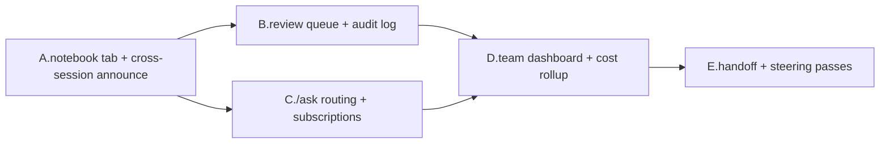

# AI-native team collaboration in myco — research + proposal

**Status:** research draft · 2026-05-17 · author: claude (kkrazy session)
**Scope:** features to add to myco to make AI + human collaboration first-class.
Not a commitment — a menu the team picks from.

---

## 1. Executive summary

Myco today is a strong *single-human + claude* surface. The seams begin to
show the moment a **team** is involved — multiple humans, multiple AI
sessions, overlapping work, async handoffs, drift across days. The
shortest-distance gap closures:

1. **Cross-session memory** so two humans / two AI sessions don't re-discover
   the same finding.
2. **Routing of AI's open questions** to the right human, not OS-broadcast
   to everyone attached.
3. **Approval / review queue** so risky AI actions (deploys, deletes,
   destructive git) wait for a human nod without blocking everything else.
4. **Team-wide observability** — what's every AI doing right now, what did
   it spend, what touched what.
5. **Async handoff** — leave a task for "the next teammate", and the next
   teammate's session reads + acts on it without re-typing context.

Items 1-3 are the highest leverage and the most concretely buildable on
top of the existing primitives (rec.chat, plan.json, agent-session, share
tokens). Items 4-5 are 1-2 quarter projects.

---

## 2. What myco already has (the foundations to build on)

| Primitive | What it gives us |
|-----------|-------------------|
| `AgentSession` + WS attach | Multi-device live attach; presence chips show who's connected |
| `rec.chat` + seq # | Durable global ordering of every user + claude message |
| `_persistAssistantTextToRecChat` | Claude's replies are first-class records, not ephemera |
| `plan.json` (td / fr / bug) | Structured task list, comments, votes, run-status |
| `@user` + `@all` mentions | In-chat addressing, OS notification on mention |
| `architecture.md` artifact | Long-form project memory extracted from chat |
| `bash-elapsed.json` | Project-local runtime norms (what's slow → delegate) |
| Share tokens | Read-only viewer mode for guests |
| `canUseTool` + permission menus | Per-tool gating with allow / deny / one-shot |
| OS notifications | Browser-native pings for blocking decisions |
| `auth-sessions.json` + GitHub OAuth | Identity, allowlist gating |
| File explorer + git decorators | At-a-glance worktree state, file download |

These give us: identity, ordering, persistence, addressing, transcripts,
notifications, and a structured planning surface. Most missing pieces are
*coordination layers* on top, not new substrates.

---

## 3. Proposal — five themes, ranked by leverage

### Theme A · Cross-session memory & federation

**Problem:** Two humans on the same project open two myco sessions. Each
session has its own `_myco_/events.jsonl`, its own chat. If session A
discovers "the auth tests are flaky on port 8080 — use 9080", session B
re-discovers it 30 minutes later. Even worse: an AI session run by Alice
yesterday and an AI session by Bob today don't share notes.

**Proposed features:**

- **`_myco_/notebook.md`** — a free-form team scratchpad, surfaced as a
  new artifact tab next to Plan/Arch/Test. Append-only by default; AI
  is encouraged to write findings here ("Discovered: prisma migrations
  on docker need `--volumes` flag"). Same persistence + git contract as
  plan.json.
- **Cross-session announce** — when an AgentSession on project P writes
  a finding (e.g. a new `_myco_/notebook.md` entry, a new plan item, an
  arch.md edit), other live AgentSessions for the same project get a
  toast: "session B added a note in notebook". Implementation: file-
  watcher on `_myco_/` per project, fan-out via the existing presence
  channel.
- **Session "merge"** — open a stopped session's transcript inline in a
  live session ("show me what Alice's session did at 3 PM"). Same
  /attach/:id-viewer wire-shape, just a read-only historical mode.
- **Project-level memory query** — `/recall <topic>` slash command that
  greps every chat + notebook + plan-comment in `_myco_/` for matches,
  shows top hits inline. Easy first version: ripgrep + a 200-line max.

**Complexity:** S → M. The notebook tab is mostly a clone of arch.md
extractor + a free-form edit mode. The announce fan-out is a single
fs.watch + WS broadcast.

---

### Theme B · Approval & review queue (trust ladder)

**Problem:** Today a permission menu blocks the agent loop until any
attached human clicks. This is fine for "rm a file in /tmp" but wrong
shape for "run `./deploy.sh` to prod" — high-stakes ops should require
a *specific* human (the on-call), not whoever happens to be looking,
and should be reviewable async, not block live work.

**Proposed features:**

- **Per-tool trust tier** — extend the allow/deny list with a third
  tier "queue-for-review". When AI invokes a queued tool, the session
  pauses but DOESN'T block the agent's turn — chat continues, other
  tools work. A `🛂 Awaiting review` chip appears at the top of the
  chat pane.
- **Review queue tab** — new chrome icon next to Plan/Arch/Test
  showing pending reviews across all the user's sessions. Each row
  shows: who requested (session label + AI persona), what (tool +
  input summary + risk reason), when, and approve / reject buttons.
- **Trusted reviewer routing** — `/td` items can carry a
  `reviewer: alice` field; tool calls matching that item's scope get
  routed to alice's review queue specifically.
- **Audit log** — every approve/reject pair is appended to
  `_myco_/audit.jsonl` with (reviewer, action, tool, hash, ts).
  Already-running OAuth identity makes this trivially attributable.
- **Time-bounded auto-trust** — "trust this AI session with bash for
  the next 30 min" or "let this session use $5 of API credits before
  pausing again" — bounded delegation that auto-revokes.

**Complexity:** M. The `canUseTool` hook already returns
`allow|deny|defer`; we add a fourth `queue` state. The review queue
tab is mostly UI; the underlying state lives in `rec.permPending`.

**Why this is high-leverage:** unlocks "team gives AI more agency
without losing oversight". Today every team that wants 24/7 AI loops
has to either fully trust + risk wreckage, or fully gate + lose throughput.

---

### Theme C · AI ↔ human question routing

**Problem:** When AI hits ambiguity ("should I use prisma or drizzle?"),
the current options are: (a) ask in chat and hope someone's looking;
(b) fire OS notification to every attached device, including phones in
pockets at 11 PM; (c) just guess. None are great.

**Proposed features:**

- **`/ask @user <question>`** as a first-class agent-event — AI emits
  it via the SDK's `AskUserQuestion` tool or via slash command. The
  named user gets a high-priority chip in their session's chat pane +
  email (later) + OS notification, regardless of whether they're
  currently in this session. Other users see it as a muted "alice has
  a question from session X" line.
- **Question follow-the-thread** — when alice answers, the answer is
  posted back to the originating AI session as a `user` chat-msg with
  a `meta.replyTo: <ask-id>` link. AI sees it as conversational input
  on its next turn.
- **Question SLA / fallback** — `/ask @alice (default after 1h: just
  use prisma)` lets AI proceed with a sensible default if no reply
  arrives. Avoids the "AI is blocked, has been for 8h" pathology.
- **Topic subscriptions** — `/subscribe auth` or `/subscribe src/auth/**`
  in a user's profile. When ANY session's chat mentions auth, or
  touches a file matching the glob, that user is added to that
  session's "interested" roster + gets a digest entry. Solves the
  "I want to know when anyone breaks the auth invariant" case.

**Complexity:** S → M. `/ask` is mostly a structured chat-msg with a
`kind:'ask'` meta + special rendering. The subscription scanner is
~50 LOC server-side on top of the existing event stream.

---

### Theme D · Team observability dashboard

**Problem:** Today, to know what every AI on your team is doing, you
have to open each session's tab one by one. Per-session cost / token
spend lives only in turn_result events — no team-level rollup. No
"this session has been silent for 2 hours" alarm.

**Proposed features:**

- **`/team` dashboard** — a new top-level route (not per-session) that
  shows: every session for users in your allowlist, with live status
  (running / waiting-on-perm / idle / dead), latest activity, current
  cost burn, and a 1-line agent-state ("running tests", "awaiting
  review on deploy.sh", "idle 23 min").
- **Cost rollup** — sum `total_cost_usd` across all sessions per
  user + per day + per project. Server tracks via existing
  turn_result events; UI shows a small bar chart.
- **Stuck-session detector** — a session that's been in
  "permission_request" for >5 min OR "awaiting_claude" for >2 min
  with no chrome activity → surface as a yellow ⚠ chip on the
  /team dashboard. Lightweight; uses the events.jsonl ts gaps.
- **Replay scrubber** — open any session's transcript at a point in
  time, see what was on screen + what claude was doing. Already
  have the data (rec.chat + events.jsonl with seq #s); needs a
  read-only time-travel renderer.

**Complexity:** M → L. The dashboard route + rollup is straightforward
server-side. Replay scrubber is the bigger chunk — needs a separate
client mode that renders historical state without subscribing to live.

---

### Theme E · Async handoff

**Problem:** Alice has to step away mid-session. The AI is mid-task.
Bob comes online 2 hours later and would like to take over — but has
no easy way to know what Alice was doing, what's left, what's risky.

**Proposed features:**

- **`/handoff @bob <one-liner>`** — Alice types this; the server
  bookmarks the session's current state with a special chat row
  (`kind:'handoff'`), pings bob, and on bob's first attach the chat
  pane scrolls to the handoff marker with the one-liner pinned to the
  top.
- **Resume summary** — when a teammate attaches to a session that's
  been idle >15 min, the chat pane shows a small "Resume" banner:
  "Last activity 2h ago. AI completed 3 turns since you left. Click
  to summarise." Click → AI generates a 5-bullet recap as a
  chat-msg.
- **Steering passes** — explicit "you have the wheel" / "give me the
  wheel" semantics so two humans don't simultaneously type at the
  same AI. Lightweight lock; whoever has it gets a "🎯 driving"
  chip, others get a muted "👀 watching" + read-only input.
- **Inbox** — a new top-level item showing every pending `/ask` or
  `/handoff` or review-queue entry directed at the current user
  across all their sessions. Single funnel for "what needs my
  attention".

**Complexity:** M. Handoff bookmark + resume summary are small. The
"steering pass" is more invasive — needs server-side per-session
lock state + UI to surrender / take.

---

## 4. Sequencing recommendation

The themes above interact. Sequencing them gets us the most value per
ship:

**Phase 1 (2-3 weeks, ~1 dev):**
- Theme A (notebook tab, cross-session announce, `/recall`)
- Theme C-lite (`/ask @user` with no SLA/fallback yet)

**Phase 2 (3-4 weeks):**
- Theme B (review queue + trust ladder + audit log)
- Theme C-full (subscriptions, SLA fallback)

**Phase 3 (4-6 weeks):**
- Theme D (team dashboard, cost rollup, stuck-session)
- Theme E (handoff, resume summary, steering lock)

**Replay scrubber** (Theme D) deferred to Phase 4 — it's the highest-
effort piece and depends on stabilizing the event-history wire format.

---

## 5. How human developers + workflows need to adapt

The features in §3 are necessary but not sufficient. AI-native teamwork
also requires that **humans change how they write code, communicate,
and operate as a team**. The tools matter, but the habits matter more —
without them the tools become surfaces no one trusts.

This section is opinionated. Treat it as a working hypothesis to
challenge, not a prescription.

### 5.1 Individual habits

**Write for two readers.** Every comment, doc string, commit message,
and PR description is now read by *two* primary audiences: humans
reviewing the change, and AI reasoning about the codebase later.
Vague messages ("fix bug") starve both. The new minimum bar:

- *What changed* (one line, present tense, imperative)
- *Why* (the user-visible symptom OR the design constraint that forced it)
- *What this leaves un-done* (known follow-ups; gives AI a thread to pull on)

Worked example (from this repo, 2026-05-17):
> `chat: fix scroll-up infinite-fetch loop + bump initial-load to 8KB + bump in-memory cap to 1MB`
> *(then 30-line body explaining the loop, the cap interaction, what was
> reverted, and what tests were added).*

That body is read every time AI loads context for a future chat-pane
change. Same goes for `_myco_/architecture.md`, `_myco_/notebook.md`,
and inline comments at non-obvious decision points.

**Commit smaller, more often.** AI reasons better about a small atomic
diff than a 1500-line "weekly sync" commit. Keep each commit to one
*concept* — the same discipline that makes human review easier makes
AI's mental model of the codebase converge faster.

**Plan-first as a default for non-trivial work.** File a `/td`, `/fr`,
or `/bug` BEFORE you start coding, not after. The item gives:
- A handle the AI can run against (`▶ Run` dispatches a session to it)
- A place for comments accumulating findings
- A trail for the next teammate to understand what shipped and why

For one-line fixes, this is overkill. For anything spanning more than
~2 commits, skip it at your peril.

**Calibrate AI trust per tool, not per session.** The trust ladder
(theme B above) is only as useful as the user's discipline in using
it. The pattern that works:

1. New project / new AI model — everything starts in `queue` (review-required).
2. Spend a week observing what AI does well: read-only file ops, structured
   refactors, test additions all probably promote to `allow`.
3. Things that touched something that broke production stay in `queue`
   permanently (no exceptions; the cost of a Friday-evening incident
   dwarfs the friction of a review queue).
4. Re-calibrate quarterly — model updates, repo evolution, team turnover
   all shift the right thresholds.

**Leave breadcrumbs explicitly.** AI is good at synthesizing context
that's *written down* and bad at recovering context that's only in
someone's head. Habits that pay compound interest:
- `TODO(@alice): ...` markers attributable to a person
- `_myco_/notebook.md` entries when you discover anything non-obvious
- `ADR-NNN.md` files (architectural decision records) for design choices
  that future-you (or AI) will second-guess
- Plan-item comments with *the rationale that didn't make the commit*

**Treat AI's confident wrong answers as a known failure mode.** AI will
sometimes propose code that compiles, passes its own tests, looks
reasonable, and is subtly wrong. The mitigation isn't "trust less";
it's "verify differently":
- Read the diff, don't just the explanation.
- Run the actual feature manually if it's user-facing.
- Look at *what was deleted* with the same attention as what was added.

### 5.2 Team rituals

**Code review evolves into two passes.**
1. *AI first pass* — formatting, obvious bugs, missing tests,
   misalignment with `_myco_/architecture.md`. AI is excellent at this
   and tireless. Automate it on every PR.
2. *Human second pass* — design judgment, edge cases the AI couldn't
   foresee, "does this make sense for our users". This pass shrinks
   in mechanical effort (AI caught the typos) but rises in importance
   (AI can't catch what a customer will hate).

Don't skip the human pass. The first time you do, the result will be
fine. The tenth time, you'll ship something embarrassing.

**Standups become AI-state syncs.** The 15-minute morning sync now has
a fourth question:
> "What is your AI session blocked on, and who can unblock it?"

If alice's session has been awaiting `/ask @bob` for 6 hours, that's
the standup item. The `/team` dashboard (theme D) is the standup
artifact — open it on the shared screen, walk through any yellow ⚠
chips.

**Onboarding flips.** Today: new hire reads the wiki, pairs with a
senior, reads the codebase, asks questions in #help. Tomorrow:

- Day 1: new hire is given a myco session pointed at the project with
  a "tour guide" persona pre-loaded into CLAUDE.md. AI walks them
  through the codebase, explains conventions, points at gotchas
  recorded in `_myco_/notebook.md`.
- Week 1: new hire ships their first small fix with AI as the pair.
  Human review is by a teammate, not AI alone.
- Month 1: new hire is dispatching plan items via `▶ Run` and reviewing
  AI's work. They're trusted to manage the AI, not just consume its
  output.

**Decision logs become a team artifact, not a personal one.** Every
design choice that took >30 minutes of discussion lands in
`_myco_/decisions/YYYY-MM-DD-<topic>.md`. AI reads these on every
session start. The next time someone proposes the rejected approach,
AI knows to flag it ("we considered this in March — see decisions/
2026-03-12-auth-tokens.md").

**Postmortems include "what AI did, what humans did, who decided
what".** When something breaks, the question isn't just "was it AI's
fault or a human's"; it's "was the trust level appropriate, was the
review queue catching things it should, did the team have visibility
when it mattered". Audit log (theme B) is the primary record.

### 5.3 Skill shifts

**Skills that become more valuable:**

| Skill | Why |
|-------|-----|
| Writing clear specs | AI is a competent contractor; vague specs produce vague work |
| Architectural judgment | AI optimizes locally; humans hold the global picture |
| Test design | Tests are the gold standard for verifying AI work — write them carefully |
| Code review (deep, not just style) | AI catches typos; humans catch wrong abstractions |
| Debugging | When AI's confident-wrong code makes it to prod, debugging is the unblock |
| Calibrated skepticism | Knowing which AI outputs to trust at which level |

**Skills that get absorbed (or rebalanced):**

| Skill | What happens to it |
|-------|---------------------|
| Boilerplate generation | AI does it — humans set the template, AI fills it in |
| Routine refactors (rename, extract) | AI does it — humans audit |
| Initial test scaffolding | AI drafts, humans verify the coverage is real |
| Documentation drafting | AI drafts, humans edit for accuracy |
| Searching docs / Stack Overflow | AI does it — humans verify the answer fits this codebase |

The shift isn't "AI replaces juniors" — it's "everyone does more of
the high-judgment work because the mechanical work is faster". Roles
that previously specialized in mechanics (junior dev grinding through
tickets, QA running manual scripts) shift toward design + judgment.

**A new role to budget for: AI policy admin.** Someone owns the trust
ladder, the audit log, the deny-list, the subscription topics, the
review-routing rules. Small team: tech lead carves out an hour a
week. Large team: 0.25-0.5 FTE.

### 5.4 Anti-patterns to actively avoid

1. **Rubber-stamping AI diffs.** "AI wrote it, AI tested it, ship it"
   is a velocity trap. The first three diffs you skip review on will
   be fine. The fourth will silently break something subtle. Mandatory
   human review of EVERY merged PR, no exceptions.

2. **AI-only spec writing.** Letting AI generate the spec because it's
   faster collapses the spec → code feedback loop. The spec is the
   contract between the humans deciding what to build and the agent
   building it. Humans write specs.

3. **"AI wrote it, so we don't need tests."** Inverted. AI code needs
   *more* test coverage, not less, because the failure modes are
   different from human-written code. AI confidently produces code
   that passes its own tests but misses cases the human author would
   have caught from lived experience with the bug.

4. **Treating AI as oracle.** AI doesn't know your customers, your
   on-call rotation, your deploy schedule, the political reasons
   behind weird code. When AI's answer surprises you, the right
   response is "tell me your reasoning" — not "ship it" and not
   "ignore it".

5. **Context debt.** Long-lived AI sessions accumulate token cost +
   irrelevant context. Discipline: close out sessions when the
   thread is done. New thread, new session. The `_myco_/` memory
   carries forward; the chat doesn't need to.

6. **Skipping human pair time.** Pairing with another human is still
   the highest-bandwidth knowledge transfer mode we have. AI augments
   it, doesn't replace it. Teams that abandon human pairing in favor
   of "everyone pairs with AI" lose the implicit norm-sharing that
   keeps a codebase coherent.

7. **No-feedback trust escalation.** Auto-promoting tools to `allow`
   because "they've been fine for a week" without an explicit human
   nod is how the unattended Friday-evening incident happens. Trust
   escalation is a deliberate act, logged, attributable.

8. **Hiding AI usage from teammates.** If alice uses AI to ship a fix
   and bob doesn't know AI was involved, bob can't calibrate his
   review. AI usage is metadata on the commit (e.g. `Co-Authored-By:
   Claude` line, already standard in our commits), not a secret.

### 5.5 Management adapts too

**New metrics.** Velocity goes up, but quality variance might too.
Track:
- Diffs reverted within 7 days (AI's confidently-wrong rate)
- Time-in-review-queue (theme B latency)
- Cost per shipped feature (theme D rollup)
- New-contributor time-to-first-merge (onboarding effect)
- % of plan items closed with their stated test coverage

**AI policy as a real artifact.** Not a memo — a file in the repo:
- `_myco_/policy/ai-allowed-tools.md`: what AI may run unattended
- `_myco_/policy/ai-deny-list.md`: never-touched paths (prod creds,
  customer DBs, deploy keys)
- `_myco_/policy/review-routing.md`: who reviews what
- All version-controlled, all reviewable like code

**Cost transparency.** Per-user, per-project, per-day. Surfaced in
the `/team` dashboard. Surprises kill trust faster than incidents do.

**Performance reviews include "how well do you collaborate with AI".**
Not in a creepy way — in the same way "how well do you collaborate
with teammates" already shows up. The skill is real, it's developable,
it's worth recognizing.

---

## 6. Open design questions

- **Where does the notebook live cross-project?** Per-project today
  (`<absCwd>/_myco_/notebook.md`). Should there be a personal
  notebook (user-scoped, all projects) and a team notebook
  (project-scoped, all users)?
- **Review queue durability** — should pending reviews survive a
  server restart? (Yes — persist to `_myco_/permissions/queue.jsonl`.)
- **`/ask` cost** — when AI fires `/ask @alice`, who's billed for the
  turns alice's reply triggers? Suggested: the original session
  owner, but track for transparency.
- **Subscription noise floor** — `/subscribe auth` could fire dozens
  of times a day. Need throttling + digest mode.
- **Steering lock + automation** — if AI session is running unattended
  (cron-driven, e.g.), nobody is "driving". Resolve: AI implicitly
  drives unless a human takes the wheel.
- **Privacy** — once cross-session announce exists, a session's notes
  leak to teammates by default. Opt-out toggle or per-session
  visibility?
- **Trust-ladder bootstrap** — how does a new AI session inherit
  trust state from the previous one? Per-tool-pattern (already what
  allow-list does), per-session (each session restarts cold), or
  per-user?

---

## 7. Anti-features (things to deliberately NOT add)

- **No new chat surfaces for the AI to "speak through".** Stay
  within `agent-event` + `chat` frames; don't fork them.
- **No per-feature DB.** Everything lives in `_myco_/*.{json,jsonl,md}`
  or `/data/*.json` — keeps the "git pull = onboard" property of
  rule 5 in best-practices.
- **No silent AI-to-AI loops.** Anything one AI session does that
  affects another must be visible to humans in the chat record. We
  don't build invisible AI mesh — every action is auditable.

---

## 8. Filing this against `plan.json`

Each theme above becomes a feature request. Filed under fr-12 through
fr-16 (see plan.json entries dated 2026-05-17). The granular sub-tasks
inside each theme can be filed as individual `td-` items when
implementation kicks off.

---

*This doc is a research draft, not a commitment. Edit freely; commit
+ push edits per rule 5.*
