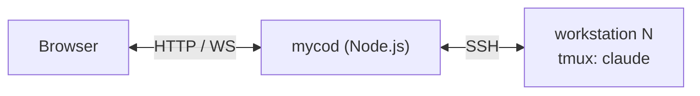

# Mycelium — Architecture

## Overview

Mycelium is a web UI to monitor and control Claude Code agent sessions running on remote workstations over SSH. It is mobile-first, with a custom keyboard tuned for Claude Code's interaction patterns.



---

## Components

### 1. Server (`server/`)

A single Node.js process that bridges workstations and browsers.

**Responsibilities:**
- Reads `config.json` listing workstations (`[{ id, host, user, port?, identityFile? }]`)
- Maintains one persistent SSH connection per workstation via the `ssh2` npm package; reconnects with exponential backoff
- Proxies pty bytes between browser WebSockets and remote tmux sessions via `ssh exec`
- Tracks known sessions in memory — no database

**Source files:**

| File | Responsibility |
|------|---------------|
| `src/index.js` | Express + ws bootstrap (~80 lines) |
| `src/ssh.js` | SSH connection manager (~120 lines) |
| `src/pty.js` | WebSocket-to-pty bridge (~50 lines) |

### 2. Web (`web/public/`)

A static single-page application using xterm.js for terminal rendering.

**Source files:**

| File | Responsibility |
|------|---------------|
| `index.html` | Shell: sessions list + terminal view |
| `app.js` | Router and state (~150 lines) |
| `keyboard.js` | Claude Code-aware custom keyboard (~200 lines) |
| `styles.css` | Mobile-first styles |
| `vendor/xterm.js` | Terminal renderer |

---

## API

### HTTP

| Method | Path | Description |
|--------|------|-------------|
| `GET` | `/sessions` | Returns in-memory union of sessions across all workstations |
| `POST` | `/sessions` | Spawn a new session: `{ workstation, cwd, prompt? }` → SSH runs `tmux new-session`, returns new uuid |

### WebSockets

**`/attach/:session_id`** — terminal proxy

```
client → server:
  { "t": "input", "data": "<base64 bytes>" }
  { "t": "resize", "cols": 80, "rows": 24 }

server → client:
  { "t": "output", "data": "<base64 bytes>" }
  { "t": "exit", "code": 0 }
```

One SSH channel per browser viewer. Multiple browsers can attach simultaneously — tmux handles multiplexing at the session level.

---

## Mobile Keyboard

The custom keyboard is the primary product surface.

### Byte Mappings

| Button | Bytes |
|--------|-------|
| 1 / 2 / 3 | `1` `2` `3` |
| Enter | `\r` |
| Esc | `\x1b` |
| Esc-Esc | `\x1b\x1b` (one frame) |
| ↑ | `\x1b[A` |
| ↓ | `\x1b[B` |
| Tab | `\t` |
| Ctrl+C | `\x03` |
| Shift+Enter | `\x1b\r` |

Each tap is its own WebSocket frame — no debouncing, no auto-Enter on digits.

### UX Rules

- `inputmode="none"` on the focused element — OS soft keyboard suppressed by default
- Haptic feedback on every tap via `navigator.vibrate(10)`
- Portrait locked in chat view; landscape allowed in terminal-only view

---

## Data Flow

### Terminal Attach

```mermaid
sequenceDiagram
    participant B as Browser
    participant S as Server
    participant W as Workstation

    B->>S: WS /attach/:session_id
    S->>W: ssh exec: tmux attach -t &lt;id&gt; (pty)
    B->>S: { t:"input", data }
    S->>W: stdin bytes
    W-->>S: stdout bytes
    S-->>B: { t:"output", data }
```

### Session Spawn

```mermaid
sequenceDiagram
    participant B as Browser
    participant S as Server
    participant W as Workstation

    B->>S: POST /sessions { workstation, cwd }
    S->>W: ssh: tmux new-session -d -s myco-&lt;uuid&gt; 'claude'
    W->>W: claude starts
    S-->>B: { session_id }
```

---

## Stage 2 (Deferred)

### Hook (`hook/`)

A Bash script invoked by Claude Code's hook system on every lifecycle event. Writes `~/.myco/sessions/<session_id>/state.json` on the workstation, enabling the server to track session status and the keyboard to switch modes automatically.

**Constraints:**
- Must complete in <50ms
- Must never block Claude
- Exits 0 on any error (fail-silent)
- Uses `jq` for JSON manipulation and `flock` for atomic writes

**Installed files:**
- `hook.sh` — main event handler
- `install.sh` — copies to `~/.myco/`, merges hooks into `~/.claude/settings.json`

---

## Operational Notes

- **No auth in v1** — run on localhost or behind Tailscale
- **No daemon on workstation** — sessions run as plain tmux sessions
- **SSH resilience** — reconnect with exponential backoff
