# CodeHub PAT 登录设计方案

## 一、背景与目标

### 1.1 背景

根据 `docs/auth-mechanism-analysis.md` 分析，当前系统已支持：
- **GitHub OAuth 登录**（主流程）
- **GitHub/Gitee PAT 登录**（显式平台选择）

PAT 登录架构已具备良好的扩展性：
- 白名单支持 `provider:login` 格式
- Token 存储采用两级 key 结构（天然支持多平台）
- Git 操作已抽象为 `provider → strategy` 分发模式

### 1.2 目标

新增 **CodeHub 平台** PAT 登录支持，使华为内部用户可以通过 CodeHub PAT 登录 myco 系统。

### 1.3 CodeHub API 特性

| 特性 | GitHub | Gitee | CodeHub |
|------|--------|-------|---------|
| 用户信息 API | `api.github.com/user` | `gitee.com/api/v5/user` | `codehub-y.huawei.com/api/v4/user` |
| Token Header | `Authorization: token xxx` | Query param `access_token` | `PRIVATE-TOKEN: xxx` |
| SSL 验证 | 标准 HTTPS | 标准 HTTPS | **需要 insecure（忽略证书验证）** |
| API 风格 | GitHub REST v3 | Gitee v5 | GitLab v4 兼容 |

**关键差异：SSL Insecure**

CodeHub 服务器证书可能为自签名或存在链问题，需要 `rejectUnauthorized: false` 才能正常访问。这是与其他平台的重要区别。

---

## 二、设计方案

### 2.1 架构概览

```mermaid
flowchart TB
  subgraph frontend["前端 (web/public/index.html)"]
    loginForm["登录表单<br/>provider 下拉框"]
    loginForm -->|"新增 CodeHub 选项"| select["<select id='login-pat-provider'>"]
  end
  
  subgraph backend["后端 (server/src/)"]
    auth["auth.js<br/>KNOWN_PROVIDERS"]
    gitTokens["git-tokens.js<br/>Token 存储"]
    gitHosts["git-hosts.js<br/>平台适配"]
    index["index.js<br/>/auth/login 路由"]
    
    auth -->|"新增 'codehub'"| authSet["KNOWN_PROVIDERS.add('codehub')"]
    gitTokens -->|"新增 'codehub'"| tokensSet["KNOWN_PROVIDERS.add('codehub')"]
    gitHosts -->|"新增策略"| fetchUser["_fetchUserCodehub()"]
    gitHosts -->|"新增 insecure helper"| httpsInsecure["_httpsJsonInsecure()"]
  end
  
  subgraph storage["存储层"]
    allowlist["allowed-github-users.txt<br/>支持 codehub:login 格式"]
    tokenStore["git-tokens.json<br/>两级 key 结构"]
  end
  
  frontend -->|"POST /auth/login<br/>{provider: 'codehub', token: PAT}"| backend
  backend -->|"验证 token"| gitHosts
  gitHosts -->|"调用 CodeHub API<br/>insecure 模式"| codehubApi["https://codehub-y.huawei.com/api/v4/user"]
  backend -->|"存储 token"| tokenStore
  backend -->|"检查白名单"| allowlist
```



### 2.2 修改文件清单

根据分析文档的扩展性评估，PAT 登录新增平台仅需修改 **3 个文件**：

| 文件 | 修改内容 | 复杂度 |
|------|---------|--------|
| `server/src/auth.js` | `KNOWN_PROVIDERS.add('codehub')` | ⭐ 很低 |
| `server/src/git-tokens.js` | `KNOWN_PROVIDERS.add('codehub')` | ⭐ 很低 |
| `server/src/git-hosts.js` | 新增 `_fetchUserCodehub` + `_httpsJsonInsecure` | ⭐⭐ 低 |
| `web/public/index.html` | `<select>` 添加 CodeHub 选项 | ⭐ 很低 |
| `scripts/deploy.sh` | 新增 `--allow-codehub-user` 参数 | ⭐ 很低 |

**总计：5 个文件，约 1 天工作量**

---

## 三、详细实现方案

### 3.1 `server/src/auth.js` - 添加 CodeHub 平台

**修改位置：** line 38

```javascript
// 当前代码
const KNOWN_PROVIDERS = new Set(['github', 'gitee']);

// 修改后
const KNOWN_PROVIDERS = new Set(['github', 'gitee', 'codehub']);
```

**影响范围：**
- `parseAllowlistEntry()` 将接受 `codehub:login` 格式
- `isAllowed(login, 'codehub')` 将正确检查白名单
- `addUserToAllowlist(login, 'codehub')` 将写入 `codehub:login` 条目

---

### 3.2 `server/src/git-tokens.js` - 添加 CodeHub 平台

**修改位置：** line 40

```javascript
// 当前代码
const KNOWN_PROVIDERS = new Set(['github', 'gitee']);

// 修改后
const KNOWN_PROVIDERS = new Set(['github', 'gitee', 'codehub']);
```

**影响范围：**
- `setUserToken(user, 'codehub', token)` 将存储用户级 CodeHub token
- `setRepoToken(user, 'codehub', owner, repo, token)` 将存储仓库级 CodeHub PAT
- `listAllPats(user)` 将正确列出 CodeHub tokens

---

### 3.3 `server/src/git-hosts.js` - 核心适配实现

#### A. 新增 SSL Insecure Helper

**修改位置：** 在 `_httpsJson()` 函数后添加（约 line 82）

```javascript
// ── SSL insecure HTTPS helper ────────────────────────────────────────────────
//
// Same shape as _httpsJson, but with rejectUnauthorized: false for hosts
// that use self-signed or problematic certificates (e.g. CodeHub).
// ONLY use this when the target host explicitly requires insecure mode.
function _httpsJsonInsecure({ hostname, path, method, headers, body }) {
  return new Promise((resolve) => {
    const payload = body == null ? '' : (typeof body === 'string' ? body : JSON.stringify(body));
    const hdrs = { ...headers };
    if (payload) hdrs['Content-Length'] = Buffer.byteLength(payload);
    const req = https.request({
      hostname,
      path,
      method,
      headers: hdrs,
      timeout: 15000,
      rejectUnauthorized: false,  // ← 关键差异：忽略证书验证
    }, (res) => {
      let chunks = '';
      res.on('data', (d) => { chunks += d.toString(); });
      res.on('end', () => {
        let parsed = {};
        try { parsed = chunks ? JSON.parse(chunks) : {}; } catch {}
        resolve({ status: res.statusCode, body: parsed, headers: res.headers || {} });
      });
    });
    req.on('error', (err) => resolve({ status: 0, body: { error: err.message }, headers: {} }));
    req.on('timeout', () => { try { req.destroy(); } catch {}; resolve({ status: 0, body: { error: 'timeout' }, headers: {} }); });
    if (payload) req.write(payload);
    req.end();
  });
}
```

#### B. 新增 CodeHub fetchUser 实现

**修改位置：** 在 `_fetchUserGitee()` 函数后添加（约 line 212）

```javascript
async function _fetchUserCodehub(token, httpsJson) {
  // CodeHub uses GitLab v4 API style:
  //   - Endpoint: /api/v4/user
  //   - Header: PRIVATE-TOKEN (not Authorization)
  //   - Host: codehub-y.huawei.com
  //   - SSL: may require insecure mode (self-signed cert)
  const fetcher = httpsJson || _httpsJsonInsecure;  // ← 默认使用 insecure 版本
  const result = await fetcher({
    hostname: 'codehub-y.huawei.com',
    path: '/api/v4/user',
    method: 'GET',
    headers: {
      'PRIVATE-TOKEN': token,  // ← GitLab/CodeHub 风格 header
      'User-Agent': 'myco/1.0',
    },
  });
  if (result.status < 200 || result.status >= 300 || !result.body.username) {
    throw new Error(result.body.message || result.body.error || `codehub /user HTTP ${result.status}`);
  }
  // GitLab v4 returns { id, username, name, avatar_url }
  // Map to the common shape expected by /auth/login
  return {
    login: result.body.username,
    id: result.body.id,
    name: result.body.name || result.body.username,
    avatar_url: result.body.avatar_url || '',
  };
}
```

#### C. 更新 fetchUser dispatcher

**修改位置：** line 214-220

```javascript
async function fetchUser(opts) {
  const provider = String(opts && opts.provider || '').toLowerCase();
  const token = opts && opts.token;
  if (!token) throw new Error('token required');
  if (provider === 'github') return _fetchUserGithub(token, opts.httpsJson);
  if (provider === 'gitee') return _fetchUserGitee(token, opts.httpsJson);
  if (provider === 'codehub') return _fetchUserCodehub(token, opts.httpsJson);  // ← 新增
  throw new Error(`unknown provider: ${opts && opts.provider}`);
}
```

#### D. 可选：支持 CodeHub Issue API（如需要 `/feature` `/bug` 功能）

如果需要在 CodeHub 仓库中创建 issue，需要额外实现 `_createIssueCodehub` 和 `_fetchIssuesCodehub`。GitLab v4 API 的 issue 创建格式：

```javascript
async function _createIssueCodehub({ token, owner, repo, title, body, labels }, httpsJson) {
  const fetcher = httpsJson || _httpsJsonInsecure;
  // GitLab v4: POST /projects/:id/issues where :id can be owner/repo encoded
  const projectId = encodeURIComponent(`${owner}/${repo}`);
  const result = await fetcher({
    hostname: 'codehub-y.huawei.com',
    path: `/api/v4/projects/${projectId}/issues`,
    method: 'POST',
    headers: {
      'PRIVATE-TOKEN': token,
      'User-Agent': 'myco/1.0',
      'Content-Type': 'application/json',
    },
    body: {
      title: String(title || '').slice(0, 250),
      description: String(body || ''),
      labels: Array.isArray(labels) ? labels.join(',') : undefined,
    },
  });
  if (result.status >= 200 && result.status < 300 && result.body.iid) {
    // GitLab returns iid (internal issue id) not number
    return { number: result.body.iid, url: result.body.web_url };
  }
  return {
    error: result.body.message || result.body.error || `CodeHub API ${result.status}`,
    status: result.status,
  };
}
```

**注：** Issue API 实现为可选扩展，第一阶段仅需实现 PAT 登录验证即可。

---

### 3.4 `web/public/index.html` - 前端 UI

**修改位置：** line 448-451

```html
<!-- 当前代码 -->
<select id="login-pat-provider">
  <option value="github">GitHub</option>
  <option value="gitee">Gitee</option>
</select>

<!-- 修改后 -->
<select id="login-pat-provider">
  <option value="github">GitHub</option>
  <option value="gitee">Gitee</option>
  <option value="codehub">CodeHub</option>
</select>
```

---

### 3.5 `scripts/deploy.sh` - 白名单管理命令

**修改位置：** 添加新的 `--allow-codehub-user` 参数处理

```bash
# 在现有的 --allow-github-user / --allow-gitee-user 后添加
--allow-codehub-user)
  if [ -z "$2" ]; then
    echo "Usage: $0 --allow-codehub-user <login>" >&2
    exit 1
  fi
  _add_allowed_user "$2" "codehub"
  shift 2
  ;;
```

---

## 四、实现计划清单

### Phase 1: PAT 登录验证（核心功能）

| # | 步骤 | 文件 | 验证点 | 负责人 |
|---|------|------|--------|--------|
| 1 | `auth.js` 添加 `codehub` 到 `KNOWN_PROVIDERS` | `server/src/auth.js:38` | 单元测试：`parseAllowlistEntry('codehub:alice')` 返回正确结果 | |
| 2 | `git-tokens.js` 添加 `codehub` 到 `KNOWN_PROVIDERS` | `server/src/git-tokens.js:40` | 单元测试：`setUserToken(user, 'codehub', token)` 正常存储 | |
| 3 | `git-hosts.js` 新增 `_httpsJsonInsecure` helper | `server/src/git-hosts.js:82+` | 集成测试：调用 CodeHub API 成功返回用户信息 | |
| 4 | `git-hosts.js` 新增 `_fetchUserCodehub` 实现 | `server/src/git-hosts.js:212+` | 集成测试：正确 PAT 返回 `{login, id, name}` | |
| 5 | `git-hosts.js` 更新 `fetchUser` dispatcher | `server/src/git-hosts.js:214-220` | 集成测试：`fetchUser({provider:'codehub', token})` 正常工作 | |
| 6 | `index.html` 添加 CodeHub 选项 | `web/public/index.html:448-451` | UI 测试：下拉框显示 "CodeHub" 选项 | |
| 7 | `deploy.sh` 添加 `--allow-codehub-user` | `scripts/deploy.sh` | 手动测试：`./scripts/deploy.sh --allow-codehub-user alice` 写入 `codehub:alice` | |
| 8 | 编写 PAT 登录集成测试 | `test/codehub-pat-login.test.js` | 测试脚本通过：完整登录流程测试 | |
| 9 | 运行完整测试套件 | `./test/test.sh` | 所有测试通过（包括新增测试） | |

### Phase 2: 可选扩展（如需要 `/feature` `/bug` 支持）

| # | 步骤 | 文件 | 验证点 | 备注 |
|---|------|------|--------|------|
| 10 | `git-hosts.js` 新增 `_createIssueCodehub` | `server/src/git-hosts.js` | 集成测试：在 CodeHub 仓库创建 issue | 仅当需要 issue 创建功能时 |
| 11 | `git-hosts.js` 新增 `_fetchIssuesCodehub` | `server/src/git-hosts.js` | 集成测试：读取 CodeHub issue 列表 | 仅当需要 Plan view 集成时 |
| 12 | `git-hosts.js` 新增 `_closeIssueCodehub` | `server/src/git-hosts.js` | 集成测试：关闭 CodeHub issue | 仅当需要 issue 关闭功能时 |
| 13 | `git-hosts.js` 更新 `HOST_REGEX` | `server/src/git-hosts.js:34` | 集成测试：`detectHost()` 识别 CodeHub URL | 仅当需要自动检测 CodeHub 仓库时 |
| 14 | 更新相关 dispatcher | `git-hosts.js` | 集成测试：所有 API 正常 dispatch | |

---

## 五、测试方案

### 5.1 单元测试

```javascript
// test/codehub-unit.test.js

const assert = require('assert');
const auth = require('../server/src/auth');
const gitTokens = require('../server/src/git-tokens');

// Test 1: KNOWN_PROVIDERS 包含 codehub
assert.ok(auth.KNOWN_PROVIDERS.has('codehub'), 'auth.js should recognize codehub');
assert.ok(gitTokens.KNOWN_PROVIDERS.has('codehub'), 'git-tokens.js should recognize codehub');

// Test 2: parseAllowlistEntry 支持 codehub:login
const parsed = auth.parseAllowlistEntry('codehub:testuser');
assert.deepEqual(parsed, { provider: 'codehub', login: 'testuser' });

// Test 3: setUserToken 支持 codehub
gitTokens.setUserToken('testuser', 'codehub', 'test-token-123');
const stored = gitTokens.getToken('testuser', 'codehub');
assert.strictEqual(stored, 'test-token-123');
```

### 5.2 集成测试

```bash
# test/codehub-pat-login.test.js (需要在有真实 CodeHub PAT 的环境下运行)

# 1. 使用真实 PAT 验证 API 调用
curl --insecure -H "PRIVATE-TOKEN: <your-pat>" https://codehub-y.huawei.com/api/v4/user

# 2. 测试完整登录流程
# POST /auth/login with {provider: 'codehub', token: '<pat>'}
# 期望返回: {ok: true, token: '<myco-token>', user: {login, name}}

# 3. 测试白名单
# ./scripts/deploy.sh --allow-codehub-user <login>
# 验证 allowed-github-users.txt 包含 codehub:<login>
```

### 5.3 回归测试

```bash
# 运行完整测试套件
./test/test.sh

# 确保现有 GitHub/Gitee 功能不受影响
# 包括：
#   - PAT 登录
#   - OAuth 登录（GitHub）
#   - /feature /bug slash commands
#   - 白名单检查
```

---

## 六、风险评估与对策

### 6.1 SSL Insecure 安全风险

**风险：** 使用 `rejectUnauthorized: false` 会降低安全性，可能暴露于 MITM 攻击。

**对策：**
1. **仅在 CodeHub 调用时使用 insecure**：其他平台继续使用标准 HTTPS
2. **环境变量控制**：可添加 `MYCO_CODEHUB_INSECURE=true` 环境变量，默认为 `false`（需要显式启用）
3. **日志标记**：每次 insecure 调用时记录警告日志 `[codehub] SSL verification disabled`
4. **长期方案**：建议 CodeHub 团队修复证书问题，或使用 CA 签发的证书

### 6.2 API 兼容性风险

**风险：** CodeHub API 可能与标准 GitLab v4 存在细微差异。

**对策：**
1. **先验证 API**：在实现前先用 curl 测试 API 响应格式
2. **错误处理**：捕获并记录 API 响应差异，便于调试
3. **文档记录**：记录 CodeHub API 的实测行为（可能与官方文档有出入）

### 6.3 白名单格式兼容性

**风险：** 现有 `allowed-github-users.txt` 可能包含无前缀的 `login`（默认 GitHub）。

**对策：**
- 向后兼容已存在：无前缀条目继续识别为 GitHub
- 新增 CodeHub 用户必须使用 `codehub:login` 格式
- 文档明确说明格式规范

---

## 七、文档更新

### 7.1 需更新的文档

| 文档 | 更新内容 |
|------|---------|
| `docs/auth-mechanism-analysis.md` | 在"支持的登录方式"中添加 CodeHub PAT 登录说明 |
| `CLAUDE.md` | 在 Deployment §4 白名单部分添加 CodeHub 示例 |
| `README.md` | 如存在，更新登录支持的平台列表 |

### 7.2 用户文档

创建 `docs/codehub-login-guide.md`：
- 如何获取 CodeHub PAT
- PAT 需要的权限范围（scope）
- 如何添加白名单
- 如何使用 PAT 登录

---

## 八、总结

### 8.1 关键修改点

1. **SSL Insecure** - CodeHub 需要 `rejectUnauthorized: false`，这是与其他平台的**核心差异**
2. **Header 格式** - CodeHub 使用 `PRIVATE-TOKEN` header（GitLab 风格）
3. **白名单格式** - 支持 `codehub:login` 格式，向后兼容无前缀格式

### 8.2 实现复杂度评估

| 维度 | 评估 |
|------|------|
| 修改文件数 | 5 个（核心功能） |
| 代码行数 | ~50 行（不含测试） |
| 工作量 | 1 天（含测试） |
| 风险等级 | 低（不影响现有功能） |
| 回归风险 | 低（新增独立分支） |

### 8.3 下一步行动

1. **原型验证**：先用 curl 测试 CodeHub API 响应格式
2. **实现 Phase 1**：完成 PAT 登录验证核心功能
3. **测试验证**：编写并运行完整测试套件
4. **部署上线**：更新文档 + 部署脚本 + 白名单管理

---

**设计日期：** 2026-06-12
**设计者：** Claude (基于 auth-mechanism-analysis.md 分析)
**版本：** v1.0