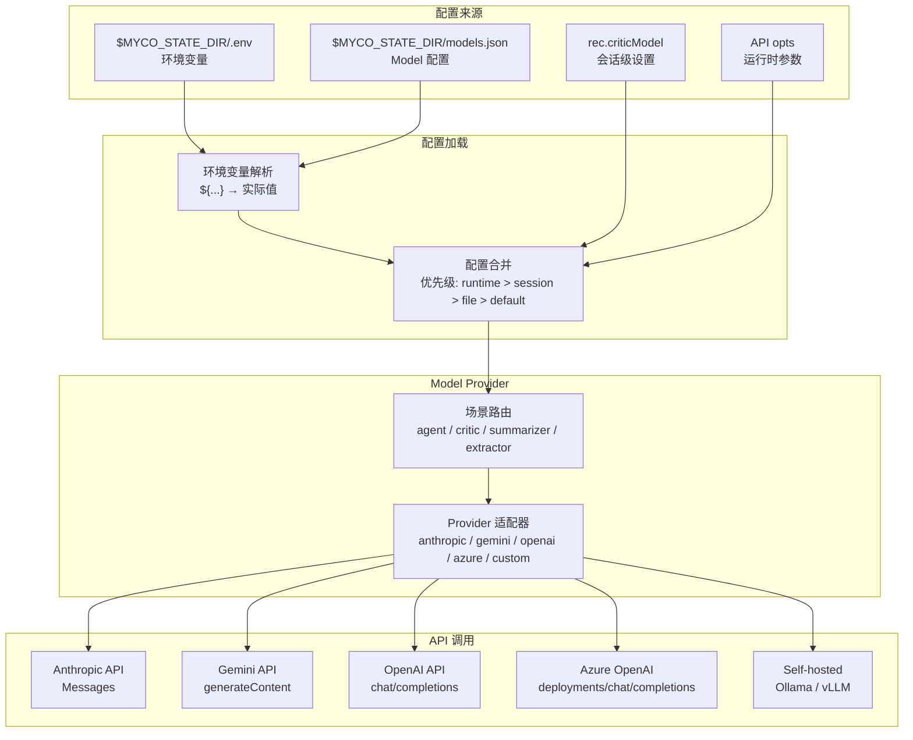

# Model Provider 配置设计

## 背景

当前 Myco 项目对不同 AI model 的配置分散在多处：
- **Anthropic API Key**: `ANTHROPIC_API_KEY` 环境变量
- **Gemini API Key**: `GEMINI_API_KEY` / `API_KEY` 环境变量
- **OpenAI API Key**: `OPENAI_API_KEY` / `CODEX_API_KEY` 环境变量
- **Base URL**: 硬编码在各模块中
- **Model 选择**: 仅 critic 支持多 provider 选择，其他场景固定

用户需求：
1. **统一配置**: 通过配置文件控制所有 model 的 provider、base URL、API token
2. **场景化选择**: 不同场景（critic、summarizer、extractor、agent）能选择不同的 model

---

## 设计方案

### 1. 配置文件结构

**位置**: `$MYCO_STATE_DIR/models.json`

**格式**: JSON 配置文件，支持多 provider + 多场景

```json
{
  "providers": {
    "anthropic": {
      "apiKey": "${ANTHROPIC_API_KEY}",
      "baseUrl": "https://api.anthropic.com/v1",
      "defaultModel": "claude-sonnet-4-6"
    },
    "gemini": {
      "apiKey": "${GEMINI_API_KEY}",
      "baseUrl": "https://generativelanguage.googleapis.com/v1beta",
      "defaultModel": "gemini-2.5-pro"
    },
    "openai": {
      "apiKey": "${OPENAI_API_KEY}",
      "baseUrl": "https://api.openai.com/v1",
      "defaultModel": "gpt-4o"
    },
    "azure-openai": {
      "apiKey": "${AZURE_OPENAI_API_KEY}",
      "baseUrl": "${AZURE_OPENAI_ENDPOINT}",
      "apiVersion": "2024-02-15-preview",
      "defaultModel": "gpt-4"
    },
    "custom": {
      "apiKey": "${CUSTOM_API_KEY}",
      "baseUrl": "http://localhost:11434/v1",
      "defaultModel": "llama3"
    }
  },
  "scenarios": {
    "agent": {
      "provider": "anthropic",
      "model": "claude-sonnet-4-6"
    },
    "critic": {
      "provider": "gemini",
      "model": "gemini-2.5-pro",
      "alternatives": ["openai:gpt-4o", "anthropic:claude-haiku-4-5"]
    },
    "summarizer": {
      "provider": "anthropic",
      "model": "claude-haiku-4-5"
    },
    "extractor": {
      "provider": "anthropic",
      "model": "claude-haiku-4-5"
    },
    "btw": {
      "provider": "anthropic",
      "model": "claude-haiku-4-5"
    }
  },
  "fallback": {
    "provider": "anthropic",
    "model": "claude-haiku-4-5"
  }
}
```

### 2. 环境变量支持

为保持向后兼容，支持以下环境变量：

| 环境变量 | 说明 | 配置文件优先级 |
|---------|------|--------------|
| `MYCO_MODELS_CONFIG_PATH` | 自定义配置文件路径 | 最高（覆盖默认位置） |
| `MYCO_CRITIC_MODEL` | Critic 默认 model | 低于配置文件 |
| `ANTHROPIC_API_KEY` | Anthropic API Key | 作为 `${...}` 引用值 |
| `GEMINI_API_KEY` | Gemini API Key | 作为 `${...}` 引用值 |
| `OPENAI_API_KEY` | OpenAI API Key | 作为 `${...}` 引用值 |

**环境变量引用语法**: 配置文件中的 `apiKey` 可使用 `${ENV_VAR}` 语法引用环境变量，避免将敏感信息写入文件。

---

### 3. Provider 适配层

**新增模块**: `server/src/models/` (Phase 1-2 已实现)

**目录结构**:
```
server/src/models/
├── index.js           # 入口：getProviderForScenario(), getAllProviders(), reloadConfig(), getConfig()
├── provider.js        # ModelProvider 基类
├── defaults.js        # 硬编码默认配置（Phase 1）
├── configLoader.js    # 配置文件加载 + 环境变量解析（Phase 2）
├── models.json.example # 配置文件模板（Phase 2）
├── README.md          # 配置说明文档（Phase 2）
└── providers/
    ├── anthropic.js   # Anthropic Messages API adapter
    ├── gemini.js      # GoogleGenAI SDK adapter
    ├── openai.js      # OpenAI API adapter (fetch)
    ├── azure-openai.js # Azure OpenAI Service adapter (Phase 2)
    └── custom.js      # Self-hosted/Ollama adapter
```

**ModelProvider 基类接口 (provider.js)**:

```javascript
class ModelProvider {
  constructor(config = {}) {
    this.config = config;
    this.id = config.id || 'unknown';
    this.name = config.name || 'Unknown Provider';
    this.baseUrl = config.baseUrl || '';
    this.defaultModel = config.defaultModel || '';
    this.apiKey = this._resolveEnvVar(config.apiKey);
  }

  /**
   * 解析 ${ENV_VAR} 环境变量语法
   * 支持 ${VAR} 和 ${VAR:default} 两种形式
   */
  _resolveEnvVar(value) { /* ... */ }

  /**
   * 调用 model API
   * @param {string} prompt - 用户 prompt
   * @param {string} systemInstruction - 系统指令（可选）
   * @param {object} opts - 可选参数（model override, maxTokens, temperature 等）
   * @returns {Promise<string|null>} - model 返回的文本或 null（失败时）
   */
  async call(prompt, systemInstruction, opts) {
    throw new Error('Not implemented');
  }

  /**
   * 检查 provider 是否可用（如 API key 存在）
   */
  isAvailable() { return !!this.apiKey; }

  /**
   * 获取 provider 元数据
   */
  getMetadata() { return { id, name, model: this.defaultModel }; }
}
```

**场景路由 (models/index.js)**:

```javascript
/**
 * 获取指定场景的 provider
 * @param {string} scenario - 'agent' | 'critic' | 'summarizer' | 'extractor' | 'btw'
 * @param {object} opts - 覆盖选项
 *   - preferId: 指定 provider ID（用于 critic 选择特定 model）
 */
function getProviderForScenario(scenario, opts = {}) {
  // Phase 1: 使用 defaults.js 硬编码配置
  // Phase 2: 加载 models.json 配置文件

  if (opts.preferId && providers[opts.preferId]) {
    return providers[opts.preferId];
  }

  const scenarioConfig = defaults.scenarios[scenario] || defaults.fallback;
  const providerId = scenarioConfig.provider || 'anthropic';
  return providers[providerId] || providers.anthropic;
}
```
```

### 4. 场景映射

| 场景 | 当前实现位置 | 配置项 | Phase 1-2 状态 |
|-----|-------------|-------|-------------|
| **agent** | `agent-session.js` → SDK | `scenarios.agent` | **未集成** - SDK 内部管理 auth，Phase 3 待评估 |
| **critic** | `critics/*.js` → `models` | `scenarios.critic` | ✓ 已重构 - 委托给 `getProviderForScenario('critic', {preferId})` |
| **summarizer** | `anthropic.js` → `models` | `scenarios.summarizer` | ✓ 已重构 - anthropic.js 为 thin wrapper |
| **extractor** | `claude-cli.js` → SDK | `scenarios.extractor` | **未集成** - SDK 内部管理 auth，Phase 3 待评估 |
| **btw** | `btw.js` → SDK | `scenarios.btw` | **未集成** - SDK 内部管理 auth，Phase 3 待评估 |

**关键区别：**
- **API-based callers** (`anthropic.js`, `critics/*.js`) - 使用显式 API key，Phase 1-2 已完成集成
- **SDK-based callers** (`agent-session.js`, `btw.js`, `claude-cli.js`) - 使用 `claude-agent-sdk`，SDK 内部通过 ~/.claude/ 管理 auth，Phase 3 待评估可行性

---

### 5. 配置优先级

**Why**: 环境变量优先级规则确保向后兼容，同时允许配置文件覆盖。

**优先级顺序**（从高到低）：

1. **运行时参数**: API 调用时传入的 `opts.provider` / `opts.model`
2. **会话级配置**: `rec.criticModel`（仅 critic 场景）
3. **配置文件**: `$MYCO_STATE_DIR/models.json` 中的 `scenarios.{scenario}`
4. **默认值**: `defaults.js` 硬编码的 fallback

**Note**: 环境变量（如 `MYCO_CRITIC_MODEL`）通过配置文件中的 `${...}` 语法引用，在配置加载时解析，不再作为独立的优先级层。

```javascript
// 实际配置加载逻辑 (configLoader.js)
function loadConfig() {
  const configPath = getConfigPath(); // MYCO_MODELS_CONFIG_PATH || $MYCO_STATE_DIR/models.json || /data/models.json
  
  if (!fs.existsSync(configPath)) {
    return defaults; // 配置文件不存在时使用默认配置
  }
  
  const raw = JSON.parse(fs.readFileSync(configPath, 'utf8'));
  // 解析 ${...} 环境变量引用（包括 ${VAR:default} 语法）
  resolveEnvVars(raw);
  
  // 合并配置文件与默认值（file 覆盖 defaults）
  return {
    providers: mergeProviders(raw.providers, defaults.providers),
    scenarios: mergeScenarios(raw.scenarios, defaults.scenarios),
    fallback: raw.fallback || defaults.fallback,
  };
}
```

---

### 6. 动态切换机制

**会话级 critic model 切换**（保留现有功能）：

- 通过 `/critic` API 或会话 UI 切换
- 存储在 `rec.criticModel`
- 格式: `provider:model`（如 `gemini:gemini-2.5-pro`）

**运行时配置刷新**（Phase 2 已实现）：

- `reloadConfig()` 函数重新加载 `models.json` 并更新所有 provider 实例
- 无需重启服务即可应用新配置
- Phase 3 可通过 `/model-config` slash 命令调用此功能

**扩展支持**（Phase 3 待实现）：

```javascript
// 新增 API: PUT /sessions/:id/model-config
{
  "scenario": "summarizer",
  "provider": "anthropic",
  "model": "claude-opus-4-7"
}

// 或者全局刷新配置
// POST /model-config/reload → 调用 reloadConfig()
```

---

### 7. Azure OpenAI 支持 ✓ (Phase 2 已实现)

**Why**: 企业部署常使用 Azure OpenAI Service，需要支持 Azure 特有的认证方式和 endpoint。

**实现位置**: `server/src/models/providers/azure-openai.js`

**配置示例** (见 `models.json.example`):

```json
{
  "providers": {
    "azure-openai": {
      "apiKey": "${AZURE_OPENAI_API_KEY}",
      "baseUrl": "${AZURE_OPENAI_ENDPOINT}",
      "apiVersion": "2024-02-15-preview",
      "deploymentName": "gpt-4-deployment",
      "defaultModel": "gpt-4"
    }
  }
}
```

**关键差异**:
- Azure 使用 `api-key` header 而非 `Authorization: Bearer`
- URL 包含 deployment name: `/openai/deployments/{deployment}/chat/completions`
- 需要 `api-version` query parameter

---

### 8. 安全考虑

**Why**: API Key 是敏感信息，需要保护。

1. **文件权限**: `models.json` 应设为 `0600`（仅 owner 可读写）
2. **环境变量引用**: 推荐使用 `${...}` 语法，避免硬编码
3. **审计日志**: model 切换操作记录到 `_myco_/events.jsonl`
4. **API Key 验证**: 启动时检查必需的 API Key，缺失时优雅降级

```javascript
// models.json 文件权限设置
fs.writeFileSync(configPath, JSON.stringify(config, null, 2));
fs.chmodSync(configPath, 0o600);
```

---

### 9. 部署脚本支持

**扩展 `deploy.sh`**:

```bash
# 设置 model provider 配置
./scripts/deploy.sh --set-model-provider anthropic \
  --model-base-url https://api.anthropic.com/v1 \
  --model-api-key sk-ant-xxxxx

# 设置场景默认 model
./scripts/deploy.sh --set-scenario-model critic gemini:gemini-2.5-pro

# 导出完整配置
./scripts/deploy.sh --export-models-config > models.json
```

---

### 10. 实现路径

**Phase 1: Provider 适配层 ✓ (已完成 2026-06-12)**
- ✓ 新增 `server/src/models/` 目录
- ✓ 实现 `provider.js` 统一适配接口（基类 + `call(prompt, systemInstruction, opts)` 方法）
- ✓ 实现 `providers/anthropic.js` - Anthropic Messages API adapter（迁移自 anthropic.js）
- ✓ 实现 `providers/gemini.js` - GoogleGenAI SDK adapter（迁移自 critics/gemini.js）
- ✓ 实现 `providers/openai.js` - OpenAI API adapter（迁移自 critics/codex.js）
- ✓ 实现 `providers/custom.js` - Self-hosted/Ollama adapter（迁移自 critics/custom.js）
- ✓ 实现 `defaults.js` - 硬编码默认配置
- ✓ 实现 `models/index.js` - 入口 `getProviderForScenario()` + `getAllProviders()`
- ✓ 重构 `anthropic.js` 为 thin wrapper（内部调用 models，保持导出不变）
- ✓ 重构 `critics/gemini.js`、`codex.js`、`custom.js` 委托给 models 系统
- ✓ 删除未使用的 `server/src/gemini.js`（遗留代码）
- ✓ 所有测试通过（backward compatibility verified）

**Phase 1 关键决策（实际实现与设计的差异）：**

| 决策 | 原因 |
|------|------|
| `critics/*.js` 保留导出接口 + 常量声明 | `critic-gemini-calibration.test.js` 依赖 `critics/gemini.js` 中的 `CRITIC_MODEL`、`CRITIC_SAMPLING` 常量进行静态检查；删除这些常量会导致测试失败 |
| `critics/*.js` 内部委托而非直接替换 | 保持 `critics/index.js` registry 模式不变，`critique.js` 无需修改 |
| SDK-based callers 不在 Phase 1 范围 | `agent-session.js`、`btw.js`、`claude-cli.js` 使用 `claude-agent-sdk`，SDK 内部管理 auth，与 API-based callers 不同 |
| `call()` 方法参数顺序 | 实际实现: `call(prompt, systemInstruction, opts)`，opts 包含 `model`、`maxTokens`、`temperature` 等 |

**Phase 2: 配置加载 ✓ (已完成 2026-06-12)**
- ✓ 实现 `configLoader.js` - 加载 `$MYCO_STATE_DIR/models.json` 配置文件
- ✓ 支持 `${...}` 环境变量解析（包括 `${VAR:default}` 语法）
- ✓ 配置优先级链：runtime > session > file > default（env 变量通过 `${...}` 语法解析）
- ✓ 创建 `models.json.example` 配置模板文件
- ✓ 创建 `README.md` 配置说明文档
- ✓ 实现 `providers/azure-openai.js` - Azure OpenAI Service adapter
- ✓ 更新 `models/index.js` 集成 configLoader
- ✓ 实现 `reloadConfig()` 支持运行时配置更新
- ✓ 完整测试覆盖（28 个测试用例，已集成到 `test/test.sh`）

**Phase 2 关键决策（实际实现与设计的差异）：**

| 决策 | 原因 |
|------|------|
| env 变量在 configLoader 解析而非独立优先级层 | `${...}` 语法在配置加载时解析，简化优先级链为 runtime > session > file > default |
| 实现 `reloadConfig()` 功能 | 支持运行时配置更新，无需重启服务，为 Phase 3 动态切换做准备 |
| 测试覆盖提前到 Phase 2 | configLoader 是核心基础设施，需尽早验证；Phase 4 的测试任务调整为部署脚本测试 |
| Azure OpenAI provider 在 Phase 2 实现 | 设计文档已描述 Azure 支持，实现时一并完成 provider adapter |

**Phase 3: 场景集成 ✓ (已完成 2026-06-12)**
- ✓ 实现 `/model-config` slash 命令（`slashcmds.js`）
  - View mode：显示当前 session + global config 默认值
  - Mutation mode：支持 `model`, `thinking`, `effort` 参数（owner+admin only）
  - 参数验证：thinking (`enabled|disabled|auto`), effort (`low|medium|high`)
  - 状态更新：写入 `rec.modelConfig` + broadcast `state-update`
- ✓ 实现 session-level model config storage（`sessions.js`）
  - 新增 `getSessionModelConfig(sessionId)` 和 `setSessionModelConfig(sessionId, config)`
- ✓ 实现 SDK model config 注入（`agent-session.js`）
  - Import models module
  - 在 `_ensureIteration()` 中注入 `model`, `thinking`, `effort` 到 `sdkOpts`
  - 优先级：session override > global config > SDK default
- ✓ 实现配置验证 endpoints（`index.js`）
  - `GET /api/model-config/validate` - 验证当前加载的 config
  - `POST /api/model-config/validate` - dry-run 验证用户提供的 config
  - `POST /api/model-config/reload` - 重新加载 config 文件（admin only）
- ✓ 实现 attach snapshot 包含 model config（`attach.js`）
  - 在 `_sendAttachSnapshot` 中 broadcast `rec.modelConfig`
- ✓ 完整测试覆盖（18 个测试用例，已集成到 `test/test.sh`）

**Phase 3 关键决策（实际实现与设计的差异）：**

| 决策 | 原因 |
|------|------|
| `/model-config` 仅支持 model 切换，不支持 provider | SDK 不支持动态 baseUrl/API key 切换，provider 切换无实际意义 |
| `thinking` 支持 `auto` 值（设计文档未提及） | SDK 支持三种 thinking 模式：enabled, disabled, auto |
| Validation endpoint 使用 `/api/model-config/validate` 而非 `/model-config/validate` | 遵循现有 admin endpoint 模式（`/api/admin/*`） |
| Session-level config 优先级高于 global config | 用户可在单个 session 中 override global defaults |

**Phase 4: 管理命令 ✓ (已完成 2026-06-12)**
- ✓ 扩展 `deploy.sh` 支持 `--set-model-provider`、`--set-scenario-model`、`--export-models-config` 参数
- ✓ 实现 `ensure_models_json_seed()` 函数 - 首次部署时生成 models.json 模板
- ✓ 实现 `set_model_provider()` 函数 - 使用 jq 更新 provider 配置（baseUrl + apiKey）
- ✓ 实现 `set_scenario_model()` 函数 - 使用 jq 更新 scenario 默认 model
- ✓ 实现 `export_models_config()` 函数 - 导出 models.json 到 stdout
- ✓ 测试覆盖：静态检查（函数定义、参数声明）+ 集成测试（配置命令实际运行）

**Phase 4 关键决策（实际实现与设计的差异）：**

| 决策 | 原因 |
|------|------|
| 使用 `jq` 处理 JSON | deploy.sh 目标主机已有 jq 安装，语法清晰且安全 |
| 不自动触发 reloadConfig() | 用户可通过 `/model-config` slash 命令或重启容器生效 |
| API key 支持 `${ENV_VAR}` 语法 | 推荐将敏感信息存储在 .env，避免硬编码到 models.json |
| 文件权限强制 0600 | models.json 包含 API key，需保护敏感信息 |

---

### 11. 向后兼容保证 ✓

**Why**: 已有部署不应因新配置方式而中断。

**Phase 1 实际验证结果：**

| 原有模块 | 兼容方式 | 测试状态 |
|---------|---------|---------|
| `summarizer.js` | 继续调用 `callAnthropic()`，内部委托给 models | ✓ 无需修改 |
| `critique.js` | 继续使用 `getCritic(id)`，critics registry 模式不变 | ✓ 无需修改 |
| `critics/*.js` | 保留导出接口 `{id, name, runCritique}` + 常量声明 | ✓ 测试兼容 |
| 环境变量 | `ANTHROPIC_API_KEY`、`GEMINI_API_KEY`、`OPENAI_API_KEY` 等 | ✓ 继续有效 |

**Phase 2 实际验证结果：**

| 功能点 | 实现状态 | 测试状态 |
|---------|---------|---------|
| 配置文件不存在时 fallback | `loadConfig()` 返回 `defaults` | ✓ 测试覆盖 |
| 环境变量 `${VAR}` 解析 | `resolveEnvVar()` 正确解析 | ✓ 测试覆盖 |
| 环境变量 `${VAR:default}` 解析 | 支持 default 值 | ✓ 测试覆盖 |
| 配置合并逻辑 | file config 与 defaults deep merge | ✓ 测试覆盖 |
| 配置验证 | `validateConfig()` 检查必填字段 | ✓ 测试覆盖 |
| Provider 初始化延迟 | `initializeProviders()` 在首次调用时执行 | ✓ 惰性加载 |

**critics/gemini.js 兼容策略：**

```javascript
// 保留常量声明（测试依赖）
const CRITIC_MODEL = 'gemini-2.5-pro';
const CRITIC_MAX_OUTPUT_TOKENS = Math.max(4096, parseInt(env) || 8192);
const CRITIC_SAMPLING = { temperature: 0.2, topP: 0.8, maxOutputTokens: ... };

// 内部委托给 models 系统
async function runCritique(prompt, systemInstruction = '') {
  const provider = getProviderForScenario('critic', { preferId: 'gemini' });
  // ...
}
```

---

## 配置流程图



---

## 与现有配置的关系

| 配置类型 | 现有文件/变量 | 新设计位置 | 关系 |
|---------|--------------|-----------|------|
| API Key | `.env` 中 `ANTHROPIC_API_KEY` 等 | `models.json` 可引用 `.env` | **兼容** - `.env` 作为实际 Key 存储 |
| Critic Model | `MYCO_CRITIC_MODEL` env | `models.json` `scenarios.critic` | **覆盖** - 配置文件优先级更高 |
| Base URL | 硬编码在各模块 | `models.json` `providers.*.baseUrl` | **新增** - 可配置化 |
| 场景 Model | 无 | `models.json` `scenarios.*` | **新增** - 统一管理 |

---

## 下一步行动

**Phase 1 已完成 (2026-06-12)** ✓

**Phase 2 已完成 (2026-06-12)** ✓

**Phase 3 已完成 (2026-06-12)** ✓

**Phase 4 已完成 (2026-06-12)** ✓

**全部 Phase 完成 — Model Provider 配置系统实现完毕。**

---

**How to apply**: 后续实现 model provider 统一配置时，按此设计文档的 Phase 1-4 路径执行。优先保证向后兼容，渐进迁移各场景。Phase 1-3 已完成核心基础设施 + 场景集成，Phase 4 重点在运维工具。